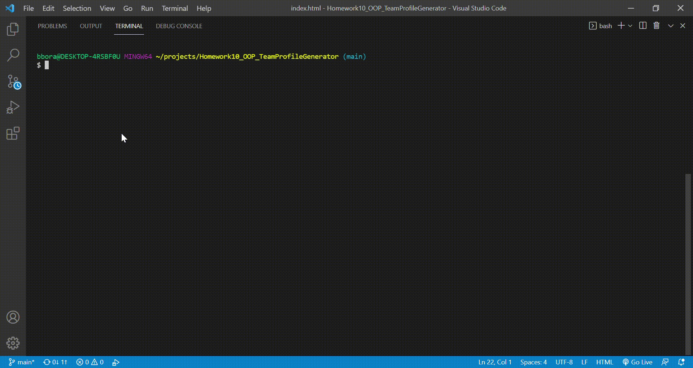

  
# Team Profile Generator
  
 

## Description 

It helps to generate my team members' information and display it to the webpage.
There are 3 roles; manager, engineer and intern.

In the web page, you can easily access to their email, github profile.

The starting command is **node index**

The video link is below
https://drive.google.com/drive/folders/1PqUcGU4hiIXtUPkVZ7ifSwUhAAqCkHGt

.gif)
.gif)

This is the sample HTML file from the execution

## Table of Contents 

- [Installation](#Installation)
- [Usage](#Usage)
- [License](#License)
- [Contributing](#Contributing)
- [Test](#Test)
- [Question](#Question)

## Installation

  ---
  To install necessary depedencies, run the following command :
  
  **npm install inquirer and jest**

  ---

## Usage

  You can check the test code in test repo. And the output would be in the dist folder. Also, lib directory shows how team member's class is defined.

## License

    There is no license here.
    

## Contributing

    nothing

## Test

  ---
  To run the test, run the following command:
  
  **npm test**

  ---

  

## Question

If you have any question about the repo, open an issue or contact me directly at bbora1119@gmail.com. You can find more of my work at https://github.com/radoll93.

  
